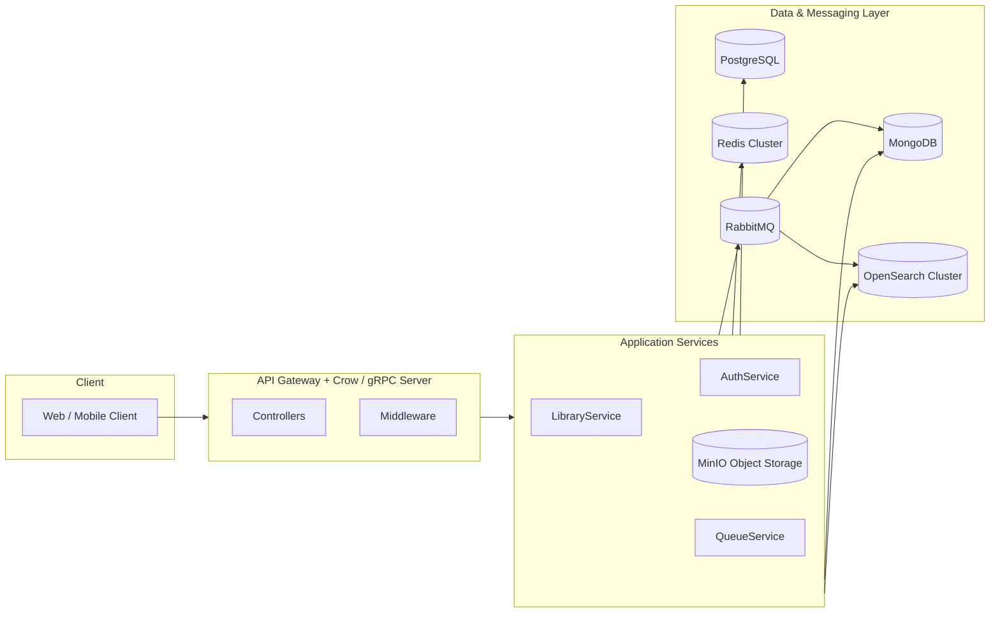
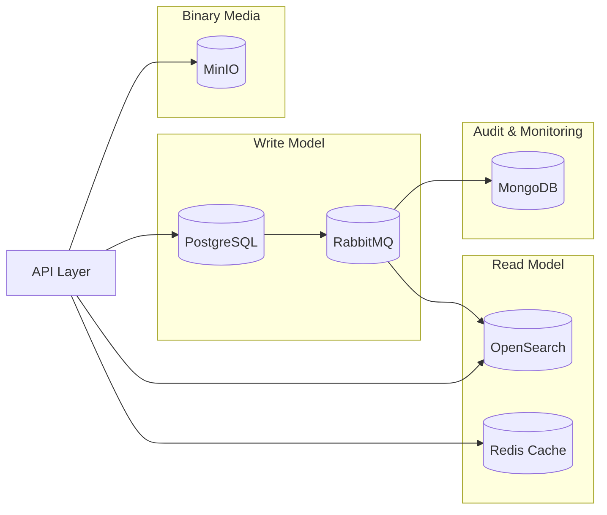

# System Architecture Document (SAD)
## Library Management System (LMS)

---

## 1. Overview

The **Library Management System (LMS)** is designed to manage and serve large volumes of digital media — such as e-books, audio, video, and documents — with support for metadata management, full-text search, high availability, and horizontal scalability.

The architecture follows **a modular layered monolithic design** inspired by **Clean Architecture** and **Domain-Driven Design (DDD)** principles.

---

## 2. Architectural Goals

| Category | Goal |
|-----------|------|
| **Performance** | Support 100,000+ transactions per second (TPS) for search and metadata reads. |
| **Scalability** | Handle >1M media records and grow horizontally across storage and caching layers. |
| **Availability** | 99.9% uptime through redundancy in data and messaging layers. |
| **Consistency** | Strong consistency in PostgreSQL; eventual consistency in OpenSearch and caches. |
| **Maintainability** | Decoupled services (API, application, infrastructure) with clear separation of concerns. |
| **Extensibility** | Ready for future microservice decomposition (media delivery, analytics). |

---

## 3. Logical View

### Layered Structure

```
+---------------------------------------------------------------+
|                        API Layer                              |
|  REST/gRPC Controllers, JWT Middleware                        |
+---------------------------------------------------------------+
|                    Application Layer                          |
|  Business Services: Auth, Library, User, Queue                |
+---------------------------------------------------------------+
|                       Domain Layer                            |
|  Core Entities: Media, Borrow, User, Rules, Policies          |
+---------------------------------------------------------------+
|                   Infrastructure Layer                        |
|  PostgreSQL, Redis, MinIO, OpenSearch, RabbitMQ, MongoDB      |
+---------------------------------------------------------------+
```

---

### Component Responsibilities

| Layer | Components | Responsibilities |
|-------|-------------|------------------|
| **API Layer** | Controllers, Middleware | Handle user requests (REST/gRPC), enforce auth via JWT. |
| **Application Layer** | Services | Implement business logic — borrowing, indexing, notifications. |
| **Domain Layer** | Entities, Policies | Define media, user, and borrowing rules. Core domain invariants. |
| **Infrastructure Layer** | Adapters (DB, Queue, Storage) | Connects to PostgreSQL, MinIO, Redis, MongoDB, OpenSearch, RabbitMQ. |

---

## 4. Physical View

### Deployment Topology



---

## 5. Technology Stack and Justification

| Technology | Role | Justification |
|-------------|------|---------------|
| **PostgreSQL** | Primary transactional database | ACID-compliant, supports relational joins and JSONB fields, ideal for structured metadata (users, borrow history, media details). |
| **Redis** | Caching and session storage | In-memory caching reduces read latency; supports key–value store for hot data and user tokens. |
| **MinIO** | Object storage for electronic media | S3-compatible, low-latency, self-hosted, ideal for storing large files (PDF, audio, video). |
| **OpenSearch** | Full-text search and analytics | Handles fuzzy search, ranking, and aggregations; decouples heavy search queries from transactional DB. |
| **MongoDB** | Logging and analytics repository | Stores semi-structured logs, audit trails, and API telemetry data. |
| **RabbitMQ** | Asynchronous task and event bus | Decouples write/read paths (CQRS pattern); enables indexing, notification, and cache invalidation. |

---

## 6. Data Flow Overview

### 6.1 Command Flow (Write Path)
1. User uploads or modifies media via API.
2. Application validates and writes metadata to **PostgreSQL**.
3. Media binary is uploaded to **MinIO**.
4. An event (`media.created`) is published to **RabbitMQ**.
5. Indexer consumes the event, extracts metadata, and updates **OpenSearch**.
6. Log events are persisted asynchronously in **MongoDB**.

### 6.2 Query Flow (Read Path)
1. User requests media search → API calls **OpenSearch**.
2. Results (ranked) are returned.
3. Details for selected media retrieved from **PostgreSQL**.
4. Redis caches frequent search results for subsequent requests.

---

## 7. Integration Diagram (CQRS Model)



---

## 8. Non-Functional Requirements

| Category | Requirement | Implementation |
|-----------|--------------|----------------|
| **Performance** | Handle 100k TPS for search queries | Redis caching, OpenSearch indexing, async pipelines |
| **Scalability** | 1M+ media items | Sharding (PostgreSQL, OpenSearch), object storage scaling |
| **Availability** | 99.9% uptime | Clustering: PostgreSQL HA, MinIO distributed mode, RabbitMQ mirrored queues |
| **Consistency** | Strong (DB), eventual (search/cache) | CQRS pattern |
| **Security** | RBAC + JWT auth | Enforced at middleware, signed URLs for MinIO |
| **Backup & Recovery** | Daily backups for PostgreSQL and MinIO | Snapshot to secondary cluster |
| **Observability** | Centralized logs and metrics | MongoDB + Prometheus/Grafana integration |
| **Latency** | < 200ms average response | Redis caching and async I/O |

---

## 9. Cross-Cutting Concerns

| Concern | Implementation |
|----------|----------------|
| **Authentication** | JWT tokens managed via Redis |
| **Authorization** | Role-based policies in domain layer |
| **Logging** | Centralized logging via MongoDB (structured JSON) |
| **Monitoring** | Prometheus + Grafana (system metrics, queue health) |
| **Error Handling** | Unified exception middleware; dead-letter queues in RabbitMQ |
| **Configuration** | Managed by EnvLoader + ConfigManager in infrastructure layer |
| **Security** | HTTPS, data encryption (AES-256 at rest, TLS in transit) |

---

## 10. Summary of Architectural Decisions

| Decision | Justification |
|-----------|----------------|
| **PostgreSQL as system of record** | Strong ACID guarantees and mature ecosystem |
| **OpenSearch for search layer** | Supports fuzzy search, relevance ranking, and horizontal scaling |
| **MinIO for object storage** | Local, low-latency, S3-compatible solution |
| **Redis cache for performance** | High-speed in-memory layer reduces repeated DB hits |
| **RabbitMQ for async events** | Enables CQRS and decoupled indexing and notifications |
| **MongoDB for logs and analytics** | Schema-flexible storage for unstructured audit data |

---

## 12. Security Overview

- **JWT Authentication** at API gateway  
- **TLS Encryption** in transit between all components  
- **S3-compatible access policies** for MinIO  
- **Role-based access control (RBAC)** within PostgreSQL and application layer  
- **Audit logging** stored in MongoDB for traceability  

---
