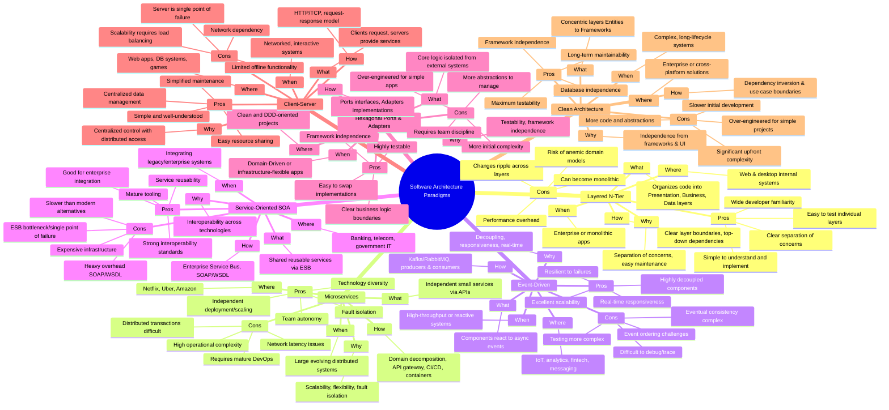

# Software Architectures and SDLC Overview

## Software Architectures

```mermaid
mindmap
  root((Software Architecture Paradigms))
    Layered N-Tier
      What
        Organizes code into Presentation, Business, Data layers
      Why
        Separation of concerns, easy maintenance
      When
        Enterprise or monolithic apps
      Where
        Web & desktop internal systems
      How
        Clear layer boundaries, top-down dependencies
      Pros
        Simple to understand and implement
        Clear separation of concerns
        Easy to test individual layers
        Wide developer familiarity
      Cons
        Can become monolithic
        Changes ripple across layers
        Risk of anemic domain models
        Performance overhead
    Microservices
      What
        Independent small services via APIs
      Why
        Scalability, flexibility, fault isolation
      When
        Large evolving distributed systems
      Where
        Netflix, Uber, Amazon
      How
        Domain decomposition, API gateway, CI/CD, containers
      Pros
        Independent deployment/scaling
        Technology diversity
        Fault isolation
        Team autonomy
      Cons
        High operational complexity
        Network latency issues
        Distributed transactions difficult
        Requires mature DevOps
    Event-Driven
      What
        Components react to async events
      Why
        Decoupling, responsiveness, real-time
      When
        High-throughput or reactive systems
      Where
        IoT, analytics, fintech, messaging
      How
        Kafka/RabbitMQ, producers & consumers
      Pros
        Highly decoupled components
        Excellent scalability
        Real-time responsiveness
        Resilient to failures
      Cons
        Difficult to debug/trace
        Eventual consistency complex
        Event ordering challenges
        Testing more complex
    Service-Oriented SOA
      What
        Shared reusable services via ESB
      Why
        Interoperability across technologies
      When
        Integrating legacy/enterprise systems
      Where
        Banking, telecom, government IT
      How
        Enterprise Service Bus, SOAP/WSDL
      Pros
        Strong interoperability standards
        Service reusability
        Good for enterprise integration
        Mature tooling
      Cons
        ESB bottleneck/single point of failure
        Heavy overhead SOAP/WSDL
        Slower than modern alternatives
        Expensive infrastructure
    Hexagonal Ports & Adapters
      What
        Core logic isolated from external systems
      Why
        Testability, framework independence
      When
        Domain-Driven or infrastructure-flexible apps
      Where
        Clean and DDD-oriented projects
      How
        Ports interfaces, Adapters implementations
      Pros
        Highly testable
        Framework independence
        Clear business logic boundaries
        Easy to swap implementations
      Cons
        More initial complexity
        Requires team discipline
        Over-engineered for simple apps
        More abstractions to manage
    Client-Server
      What
        Clients request, servers provide services
      Why
        Centralized control with distributed access
      When
        Networked, interactive systems
      Where
        Web apps, DB systems, games
      How
        HTTP/TCP, request-response model
      Pros
        Simple and well-understood
        Centralized data management
        Easy resource sharing
        Simplified maintenance
      Cons
        Server is single point of failure
        Scalability requires load balancing
        Network dependency
        Limited offline functionality
    Clean Architecture
      What
        Concentric layers Entities to Frameworks
      Why
        Independence from frameworks & UI
      When
        Complex, long-lifecycle systems
      Where
        Enterprise or cross-platform solutions
      How
        Dependency inversion & use case boundaries
      Pros
        Maximum testability
        Framework independence
        Database independence
        Long-term maintainability
      Cons
        Significant upfront complexity
        More code and abstractions
        Over-engineered for simple projects
        Slower initial development
```

## SDLC

```mermaid
mindmap
  root((SDLC Methodologies))
    Waterfall
      What
        Sequential phases: Requirements, Design, Implementation, Testing, Deployment, Maintenance
      Why
        Clear structure, well-documented, predictable timeline
      When
        Fixed requirements, regulatory projects, stable technology
      Where
        Construction, manufacturing software, government contracts
      How
        Complete each phase before moving to next, extensive documentation
      Pros
        Easy to understand and manage
        Clear milestones and deliverables
        Well-documented process
        Works well for fixed scope
      Cons
        Inflexible to changes
        Late testing finds issues too late
        Long delivery time
        High risk if requirements wrong
    Agile
      What
        Iterative development with short sprints and continuous feedback
      Why
        Flexibility, customer collaboration, rapid delivery
      When
        Evolving requirements, fast-paced environments
      Where
        Startups, web apps, product development
      How
        Sprints, daily standups, retrospectives, user stories
      Pros
        Adapts to changing requirements
        Early and continuous delivery
        Strong customer collaboration
        Reduced risk through iterations
      Cons
        Requires experienced team
        Less predictable timeline/cost
        Documentation can suffer
        Scope creep risk
    Scrum
      What
        Agile framework with defined roles, events, and artifacts
      Why
        Team collaboration, transparency, continuous improvement
      When
        Complex projects needing iterative delivery
      Where
        Software teams, product development, tech companies
      How
        2-4 week sprints, Product Owner, Scrum Master, Dev Team
      Pros
        Clear roles and responsibilities
        Regular feedback and adaptation
        Increased team accountability
        Faster time to market
      Cons
        Requires commitment from all stakeholders
        Scope creep if not managed
        Difficult to scale
        Can be meeting-heavy
    Kanban
      What
        Visual workflow management with continuous delivery
      Why
        Work-in-progress limits, flow optimization, flexibility
      When
        Continuous operations, support teams, maintenance
      Where
        DevOps teams, support, ongoing product work
      How
        Visual board, WIP limits, pull system, continuous flow
      Pros
        High flexibility and adaptability
        Easy to understand and implement
        Continuous delivery
        Identifies bottlenecks quickly
      Cons
        Less structure than Scrum
        No time-boxed iterations
        Can lack long-term planning
        Requires team discipline
    DevOps
      What
        Integration of development and operations with automation
      Why
        Faster delivery, better quality, collaboration
      When
        Frequent releases, cloud-native apps
      Where
        SaaS products, microservices, cloud platforms
      How
        CI/CD pipelines, infrastructure as code, monitoring
      Pros
        Rapid deployment and delivery
        Improved collaboration
        Automated testing and deployment
        Better system reliability
      Cons
        Requires cultural change
        Initial setup complexity
        Tooling overhead
        Security challenges if rushed
    Lean
      What
        Eliminate waste, maximize value, continuous improvement
      Why
        Efficiency, cost reduction, customer value focus
      When
        Resource-constrained projects, optimization needed
      Where
        Startups, manufacturing software, process improvement
      How
        Value stream mapping, eliminate waste, empower teams
      Pros
        Reduces waste and costs
        Faster delivery of value
        Empowers team decision-making
        Focus on customer needs
      Cons
        Can be too minimalist
        Documentation may lack
        Requires mature team
        Difficult to implement initially
    Spiral
      What
        Risk-driven iterative model with prototyping
      Why
        Risk management, early user feedback, iterative refinement
      When
        Large, complex, high-risk projects
      Where
        Military, aerospace, large enterprise systems
      How
        Repeated cycles: Planning, Risk Analysis, Engineering, Evaluation
      Pros
        Strong risk management
        Allows for prototyping
        Accommodates changes
        Early identification of risks
      Cons
        Complex to manage
        Expensive due to iterations
        Requires risk assessment expertise
        Can be time-consuming
    V-Model
      What
        Extension of Waterfall with testing at each phase
      Why
        Quality assurance, verification and validation
      When
        Safety-critical systems, high reliability needed
      Where
        Medical devices, automotive, aviation software
      How
        Each dev phase has corresponding test phase
      Pros
        High quality and reliability
        Early test planning
        Clear structure
        Good for safety-critical systems
      Cons
        Inflexible like Waterfall
        No early prototypes
        Testing only after implementation
        High cost and time
    RAD Rapid Application Development
      What
        Quick prototyping and iterative delivery with user involvement
      Why
        Speed, user feedback, reduced development time
      When
        Tight deadlines, well-defined business objectives
      Where
        Business applications, customer portals, dashboards
      How
        Prototyping, user workshops, reusable components
      Pros
        Fast development and delivery
        High user involvement
        Reduces development cost
        Flexibility in design
      Cons
        Requires skilled developers
        Not suitable for large teams
        Needs strong user commitment
        May sacrifice quality for speed
    Crystal
      What
        Family of methodologies tailored to team size and criticality
      Why
        Human-centric, flexible, pragmatic approach
      When
        Projects needing customized methodology
      Where
        Various project sizes and types
      How
        Frequent delivery, close communication, reflective improvement
      Pros
        Highly adaptable to context
        Human-focused approach
        Emphasizes communication
        Flexible framework
      Cons
        Less prescriptive guidance
        Requires experienced team
        Can be inconsistent across projects
        Learning curve for new teams
```